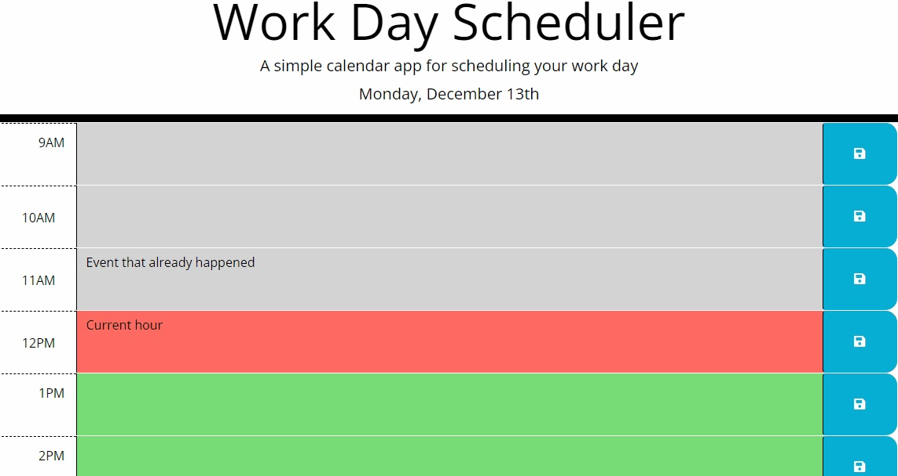

# Work Day Scheduler

## Description

The "Work Day Scheduler" is a time management tool built using JavaScript and jQuery, focusing on the manipulation of the DOM (Document Object Model). The application helps users to manage their time efficiently by highlighting the current, past, and future hours in a workday.

### Objectives

- To assist users in managing their workday schedule
- To implement DOM manipulation techniques using jQuery
- To provide a visually intuitive way of time management

### What Problem Does It Solve?

It helps users to efficiently manage their time by allowing them to enter and save tasks for each hour of the workday.

### What Did You Learn?

I gained deeper insights into DOM manipulation using jQuery, local storage, and date-time manipulation using the day.js library.

## Table of Contents

- [Installation](#installation)
- [Usage](#usage)
- [Credits](#credits)
- [License](#license)

## Installation

1. Clone the GitHub repository.
2. Open the HTML file in your preferred browser.
3. No additional installations are required.

## Usage

The application starts by displaying the current day and time slots divided into past, present, and future. Users can enter their tasks in the text areas provided and click the save button to store them locally. Saved tasks persist even after the page is reloaded.

## Credits

- [Day.js Documentation](https://day.js.org/)
- [jQuery API Documentation](https://api.jquery.com/)
- [MDN Web Docs](https://developer.mozilla.org/en-US/)

Additional credit to my the amazing team of TA's and instructor's for their invaluable guidance and input!

## License

This project is open-source and available under the MIT License. For more details, please refer to the [LICENSE.md](LICENSE.md) file in the repository.

## Badges

